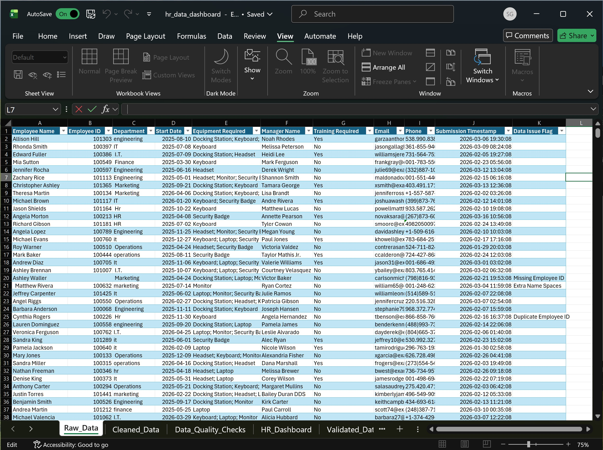
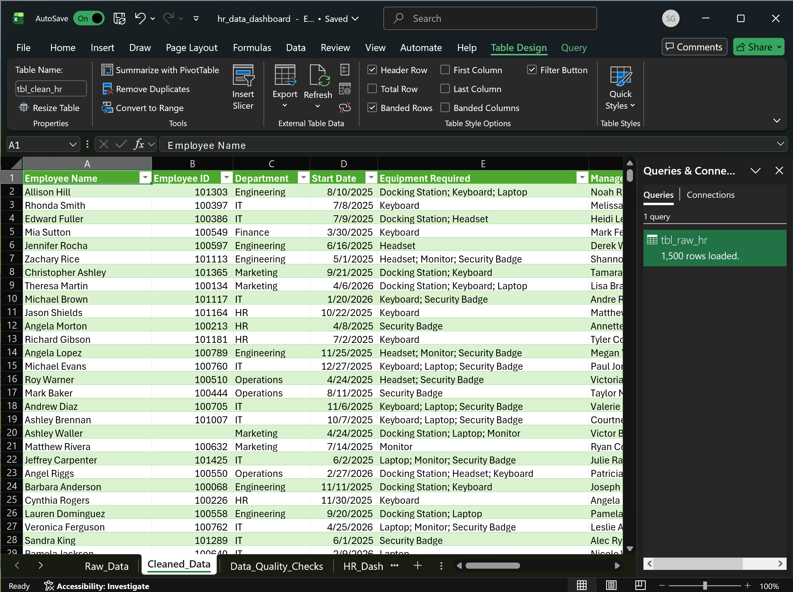
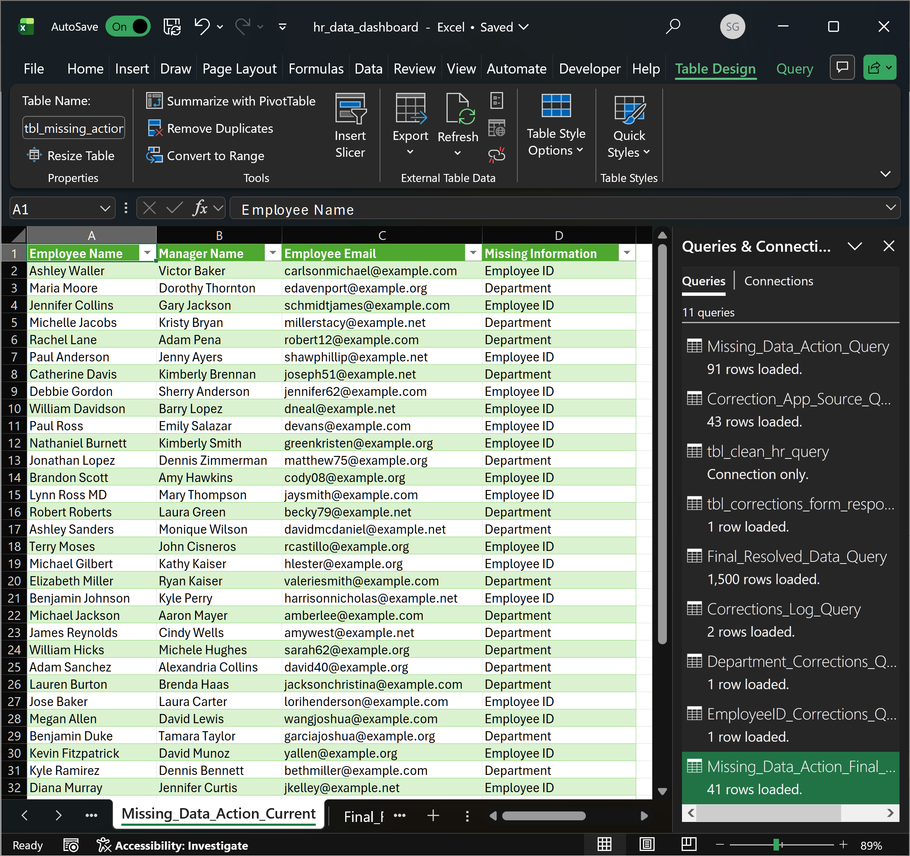
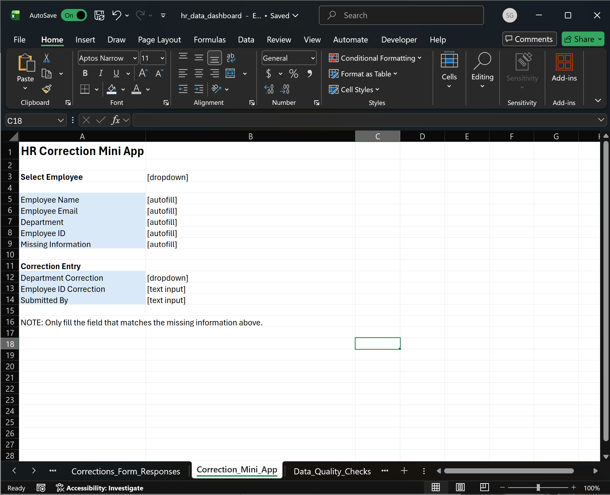
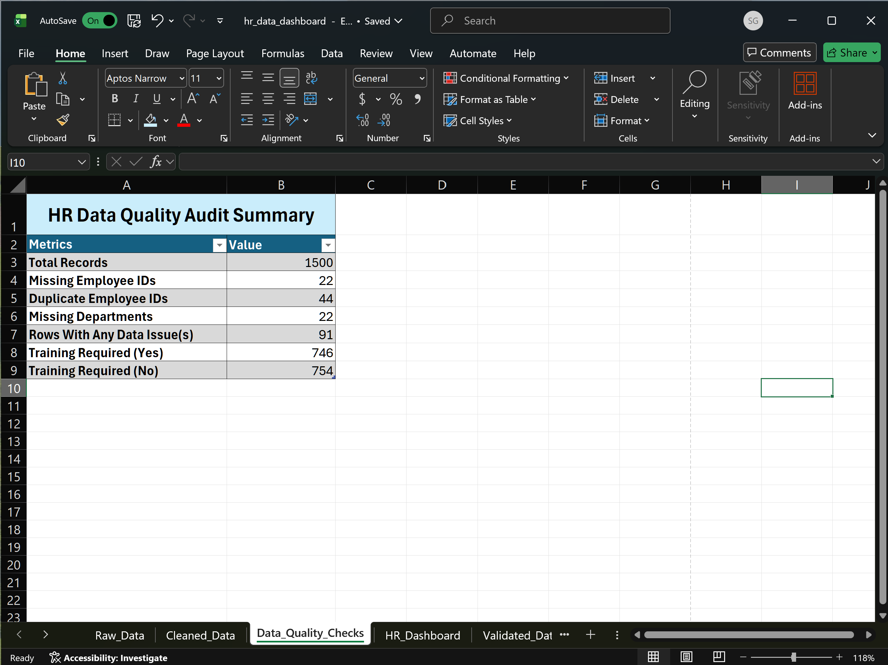
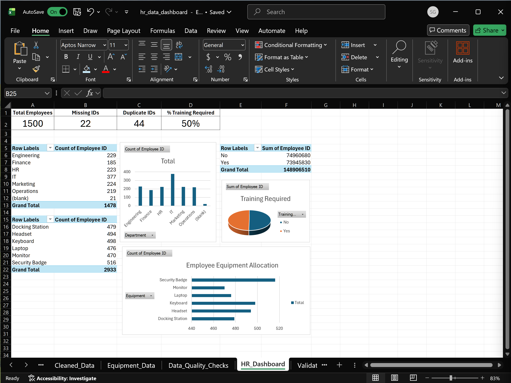

# HR Data Intake and Validation Workflow (Prototype)

## Overview

This prototype for HR data quality workflow is built to simulate how messy employee records can be ingested, cleaned, reviewed, corrected, and summarized for operational reporting.

It combines Python-based synthetic data generation with an Excel-based validation workflow using structured tables, Power Query transformations, and dashboard reporting.

Designed to demonstrate:
- Python scripting
- data generation and issue simulation
- Excel workflow design
- Power Query transformations
- data quality analysis
- dashboarding
- systems thinking for internal business processes

This repository represents the original prototype.

---

## Problem Statement

HR data is often affected by issues such as:
- missing employee IDs
- duplicate employee IDs
- missing department values
- inconsistent text formatting
- multi-value fields that need restructuring

This prototype explores how a workflow can be built to:
1. generate or ingest employee data
2. intentionally simulate realistic data quality issues
3. clean and standardize records
4. identify problematic rows
5. support correction tracking
6. summarize data quality outcomes in a dashboard

---

## Current Prototype Scope

The current prototype includes two main parts:

### 1. Python data generation layer
Generates a synthetic HR dataset, injects intentional data quality issues, and exports the result for downstream use in Excel.

### 2. Excel workflow layer
The operational prototype. 

It includes sheets and queries for:
- raw data intake
- cleaned data
- equipment normalization
- issue detection
- current-action review
- correction intake support
- validated and resolved outputs
- data quality checks
- dashboard reporting

---

## Key Features

### Python
- synthetic HR record generation
- intentional issue injection for testing realistic workflows
- export to Excel
- modular structure under `src/`

### Excel / Power Query
- raw-to-cleaned transformation flow
- text cleaning and department normalization
- issue detection for missing and duplicate fields
- correction-oriented workflow sheets
- data quality checks
- HR dashboard reporting

### Workflow Design
- prototype support for human-in-the-loop correction
- separation between intake, cleaning, issue tracking, and reporting
- designed as a portfolio project to reflect both technical and business-facing skills

---

## Tech Stack

- Python
- pandas
- Excel
- Power Query
- VBA/macros in workbook-enabled Excel file
- GitHub for version control and project presentation

---

## Repository Structure

HR-DATA-INTAKE-VALIDATION-WORKFLOW/
│
├── src/                              # Python modules for data generation and issue injection
├── screenshots/                      # Screenshots of workbook sheets, Power Query steps, and dashboard views
├── generate_hr_data.py               # Main driver script
├── generated_hr_dataset.xlsx         # Generated synthetic dataset
├── hr_data_dashboard.xlsm            # Excel workbook prototype
├── README.md

## Workflow Structure

Simplified:
```text
Python generation -> issue injection -> Excel intake -> cleaning -> issue review -> dashboard

## Workbook Structure

The Excel workbook is the core of the prototype and represents the operational workflow.

It is composed of multiple sheets that together simulate a data intake, validation, correction, and reporting system.

### Core Workflow Sheets

- `Raw_Data`  
  Original dataset generated from Python. Contains intentional data quality issues.

- `Cleaned_Data`  
  Standardized version of raw data (trimmed text, normalized formats, etc.).

- `Missing_Data_Action`  
  Full list of detected data issues (including historical and resolved).

- `Missing_Data_Action_Current`  
  Filtered list of current, unresolved issues that require action.

- `Validated_Data`  
  Intermediate dataset where corrections begin to be applied.

- `Final_Resolved_Data`  
  Fully resolved dataset used for reporting and analysis.

---

### Correction Workflow Sheets

- `Correction_App_Source`  
  Source table used to feed correction workflows.

- `Correction_Mini_App`  
  Excel-based interface for reviewing and submitting corrections.

- `tbl_corrections_form_responses`  
  Raw correction input storage.

- `Corrections_Form_Responses`  
  Structured correction submissions.

- `EmployeeID_Corrections_Query`  
  Extracted corrections specific to employee IDs.

- `Department_Corrections_Query`  
  Extracted corrections specific to departments.

- `Corrections_Log_Query`  
  Consolidated correction log.

---

### Supporting Data Sheets

- `Equipment_Data`  
  Normalized equipment assignments per employee.

---

### Reporting and Output

- `Data_Quality_Checks`  
  Summary metrics for data quality (missing values, duplicates, etc.).

- `HR_Dashboard_Original_Intake`  
  Dashboard visualizing workforce and data quality insights.

---

### Notes

Some sheets are:
- user-facing (e.g., dashboard, mini app)
- system-facing (queries, logs)
- intermediate (staging/validation layers)

Structured to reflect a full data workflow rather than a single flat dataset.

## Brief Tutorial: How to Use the Current Prototype

This prototype can be explored in two main ways:

- reviewing the Excel workflow directly
- regenerating the dataset using Python

---

### Option 1: Explore the Excel Workflow (Recommended)

This is the fastest way to understand the system.

#### Step 1: Open the workbook
Open:
hr_data_dashboard.xlsm

Enable macros if prompted.

---

#### Step 2: Start with the raw dataset



- View `Raw_Data`
- Observe missing values, duplicates, and inconsistencies
- This represents the unclean input state

---

#### Step 3: Review cleaned data



- Open `Cleaned_Data`
- See how formatting and structure are standardized
- Note that data is cleaned but not yet fully corrected

---

#### Step 4: Inspect detected issues



- Open:
  - `Missing_Data_Action`
  - `Missing_Data_Action_Current`
- Focus on `Missing_Data_Action_Current` for active issues
- These are the records that require attention

---

#### Step 5: Review correction interface



- Open `Correction_Mini_App`
- This simulates how a user would:
  - look up a record
  - input corrected values
- This represents a human-in-the-loop correction step

---

#### Step 6: Follow corrected data flow

- Open `Validated_Data`
- Then open `Final_Resolved_Data`

These represent:
- partially corrected state
- final corrected dataset used for reporting

---

#### Step 7: Review data quality metrics



- Open `Data_Quality_Checks`
- Observe:
  - missing values
  - duplicate counts
  - overall issue counts

---

#### Step 8: View dashboard output



- Open `HR_Dashboard_Original_Intake`
- This shows:
  - employee distribution
  - department breakdowns
  - summary metrics

---

### Option 2: Regenerate the Dataset Using Python

Use this if you want to explore the data generation side.

#### Step 1: Run the generator

```bash
python generate_hr_data.py

#### Step 2: Locate the output
- Synthetic HR dataset is generated in an Excel file
- Use this excel file, generated_hr_dataset.xlsx, as input to the Excel workbook (replace raw_data as such)

#### Step 3: Refresh the workbook
- Open the Excel macro-enabled workbook file, hr_data_dahsboard.xlsm
- Refresh Power Query connections if necessary

## Example Screenshots

Below are selected screenshots from the workbook to illustrate the workflow and outputs of the prototype.

---

### Raw Dataset (Input State)


The initial dataset generated from Python includes intentionally injected issues such as missing values and duplicate employee IDs.

---

### Data Quality Checks


This sheet summarizes key data quality metrics, including missing fields and duplicate counts. It provides a quick overview of the dataset's health.

---

### Current Issues (Actionable View)


This view highlights only unresolved issues that require attention. It represents the operational queue for data correction.

---

### HR Dashboard


The dashboard provides a high-level summary of workforce distribution and key metrics derived from the dataset.

---

### Correction Mini App (Prototype Interface)


This interface simulates how a user would review records and submit corrections within the Excel environment.

## Notes on the Correction Workflow

A key aspect of this project is the inclusion of a correction-oriented workflow.

Rather than only identifying data issues, the prototype is structured to support a process where issues can be reviewed and resolved in a controlled manner.

---

### Workflow Overview

The correction flow in the current prototype can be understood as:

```text
Issue Detection -> Current Issues View -> Correction Input -> Validation -> Final Resolved Data

---

### Key Components

The following sheets contribute to this workflow:

- `Missing_Data_Action`  
  Contains all detected issues, including historical and resolved records.

- `Missing_Data_Action_Current`  
  Filters the dataset to show only active, unresolved issues.

- `Correction_App_Source`  
  Provides the subset of records used for correction input.

- `Correction_Mini_App`  
  Simulates a user-facing interface for entering corrections.

- `tbl_corrections_form_responses` and `Corrections_Form_Responses`  
  Store raw and structured correction inputs.

- Query sheets (EmployeeID, Department, Log)  
  Extract and organize correction data by type.

- `Validated_Data`  
  Applies corrections onto cleaned data.

- `Final_Resolved_Data`  
  Represents the fully corrected dataset used for reporting.

---

### Design Intent

This workflow was designed to explore:

- how data issues can be surfaced clearly
- how users can interact with problematic records
- how corrections can be tracked and applied
- how a system can transition from raw data to a resolved state

The goal is to move beyond static data cleaning and toward a structured data resolution process.

---

### Current State

In this prototype version, the correction workflow should be understood as:

- partially implemented
- Excel-based
- not yet fully automated or enforced end-to-end

It demonstrates the intended structure, but is not yet a complete production-ready system.